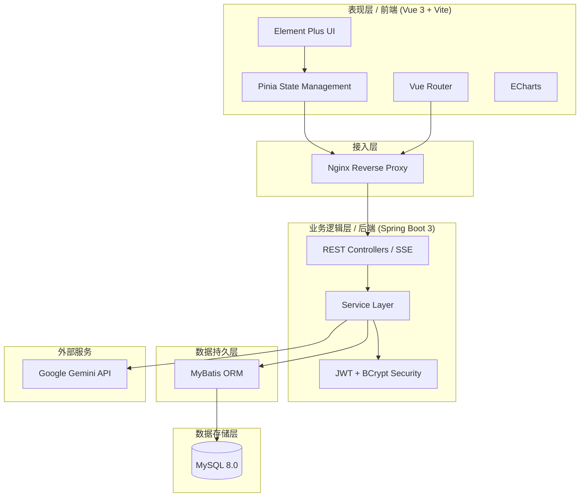
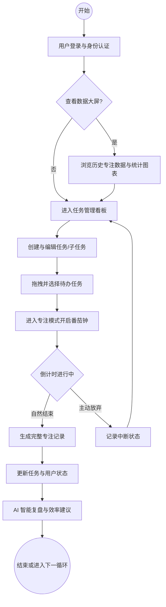
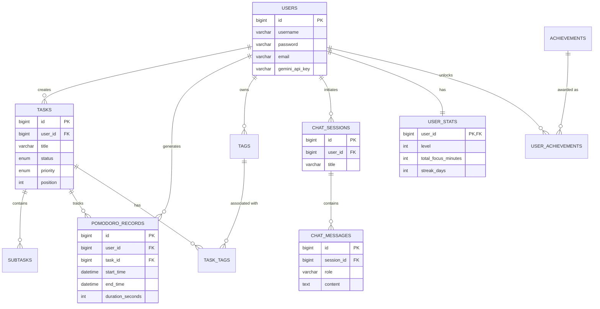

# 《ACIR 完整实现权威概述》

本文档旨在为 A Clock Inside the Rose (ACIR) 个人效率中心系统提供最详实、全面、深度的技术实现复盘，作为毕业答辩前的重要参考资料。

## 1. 项目基本架构与流程介绍

ACIR 不是一个简单的待办清单（Todo List），而是一个集“沉浸式专注”、“自我量化”与“AI 辅助”于一体的个人效率中心。为了确保系统的高可用冗余并实现前后端工程的彻底解耦，ACIR 在架构选型上全面采用了现代化的 B/S 分层体系。

### 1.1 全栈架构拓扑

系统自顶向下划分为以下几个核心层次：

1. **客户端展示层 (Frontend Layer)**：依托 Vue 3 单页应用 (SPA) 模式构建。内部利用 Pinia 编织起全局状态网，负责统筹计时器生命周期与 AI 对话历史等瞬态数据。通过定制的 Element Plus 与 Glassmorphism (毛玻璃) CSS 技术实现沉浸式 UI。ECharts 引擎负责将后台聚合的专注流水数据渲染为热力图与玫瑰图。
2. **网关与路由代理层 (Gateway Layer)**：开发环境下由 Vite 内置代理接管；生产环境中，Nginx 承担静态资源极速分发、反向代理（将 `/api/` 转发至后端）、跨域资源共享 (CORS) 策略及 HTTPS 链路加密的初级防线。
3. **后端核心服务层 (Backend Service Layer)**：基于 Spring Boot 3 构建，内部严格遵循 MVC 范式。
    - **Controller 层**：承担流量调度、RESTful API 暴露与入参校验。
    - **Service 层**：封装核心业务算法（如看板卡片的“挤占式重排”算法、番茄钟防作弊校验、上下文隐式注入策略）。
    - **Security**：基于 JWT 的无状态认证机制与 BCrypt 强哈希密码防护。
    - **External Gateway**：挂载与 Google Gemini 云端节点进行流式通信的 AI 网关。
4. **数据持久与存储层 (Persistence & Storage Layer)**：利用 MyBatis 3.x 作为 ORM 框架，将复杂的 SQL 聚合运算（如热力图按天 `GROUP BY`）下推至 MySQL 8.0 关系型数据库中，保证了海量流水账查询的高效性。

**核心架构图如下：**



### 1.2 系统业务流程闭环

ACIR 重塑了一条高内聚的“规划-执行-复盘-诊断”工作流：

1. **规划环节**：用户录入待办任务，通过多维标签体系与子任务拆解机制，将远期目标降维为可落地的动作原语。交互式看板支持卡片的高频跨列拖拽。
2. **执行环节**：用户开启番茄钟，系统主动收敛功能暴露面，触发“禅定模式”隐去冗余导航，营造“心流护城河”。偶发灵感通过“防走神便签（Zen Note）”旁路捕获。
3. **复盘环节**：专注流水落盘后，系统将其清洗聚合，在 Dashboard 和 Stats 页面映射为活跃热力图与标签玫瑰图。
4. **诊断环节**：当用户唤起 AI 助手时，系统执行“上下文注入 (Context Injection)”，抓取当前未结任务、今日专注时长等私有快照喂给 Google Gemini，输出定制化调优策略。



---

## 2. 数据库实现介绍

高交互的 Web 应用仰赖底层数据结构的严谨性。ACIR 的数据建模是对“人-事-时”三者复杂映射关系的降维解构。

### 2.1 实体关系抽象 (E-R 模型)

系统运转的轴心由多个核心实体咬合而成。用户 (`USERS`) 作为权限的拥有者，与任务 (`TASKS`)、专注流水 (`POMODORO_RECORDS`) 及标签 (`TAGS`) 保持着一对多的辐射关系。
- 为了赋予任务灵活性，标签实体被引入系统，与任务交织成多对多网络 (`TASK_TAGS`)。
- 为消解巨型任务阻力，引入了子任务 (`SUBTASKS`)。
- AI 对话历史 (`CHAT_SESSIONS` / `CHAT_MESSAGES`) 被持久化以提供上下文。
- 游戏化统计 (`USER_STATS`) 与主用户表形成一对一 (`1:1`) 的绑定，分离高频更新与低频基础信息。



### 2.2 核心物理表结构与技术设计

在将抽象模型沉淀为 MySQL 物理表时，对字段精度与安全防护进行了重点雕琢：

#### 2.2.1 用户表 (`users`)
存放用户基础信息及凭证资产。
- **技术要点 (安全防护)**：`password` 字段采用了强哈希的 **BCrypt 算法**进行单向加密落盘。由于 `gemini_api_key` 直接关乎调用成本，数据库级别的落盘数据采用了 **AES 对称加密算法**处理。这保证了即使被拖库，攻击者也无法直接盗用接口额度。

| 字段名 | 数据类型 | 描述说明 | 技术备注 |
| :--- | :--- | :--- | :--- |
| `id` | bigint | 用户唯一标识 | PK, AUTO_INCREMENT |
| `username` | varchar(50) | 用户登录名 | - |
| `password` | varchar(255) | 登录密码 | **BCrypt** 单向哈希加密 |
| `gemini_api_key`| varchar(255) | AI 密钥 | **AES** 对称加密存储 |

#### 2.2.2 任务表 (`tasks`)
系统的枢纽，设计难点在于状态控制与物理排序。
- **技术要点 (挤占式重排基石)**：表中预留了 `position` 整型排位索引字段。前端看板进行高频跨列拖拽时，后端会根据此字段执行“挤占式”重排的局部批量更新 SQL，通过 ACID 事务杜绝极端拖拽诱发的索引错乱。

| 字段名 | 数据类型 | 描述说明 | 技术备注 |
| :--- | :--- | :--- | :--- |
| `id` | bigint | 任务唯一标识 | PK, AUTO_INCREMENT |
| `user_id` | bigint | 关联用户 | FK |
| `status` | enum | 任务状态 | TODO / IN_PROGRESS / DONE |
| `position` | int | **拖拽排序位置索引** | 支撑拖拽排位算法的核心字段 |
| `due_date` | datetime | 截止日期 | AI 上下文分析的重要依据 |

#### 2.2.3 专注记录表 (`pomodoro_records`)
承受最大写入压力的核心流水表。
- **技术要点 (算力下推优化)**：为替长周期年度热力图渲染减负，冗余了 `duration_seconds` (有效专注读秒数) 字段。使得利用 MySQL 8.0 的 `DATE()` 函数进行按日聚合 `GROUP BY` 并 `SUM` 累加成为可能，将海量明细数据在离开数据库前高度压缩。

| 字段名 | 数据类型 | 描述说明 | 技术备注 |
| :--- | :--- | :--- | :--- |
| `id` | bigint | 记录唯一标识 | PK, AUTO_INCREMENT |
| `task_id` | bigint | 关联任务ID | FK, 允许为 NULL |
| `start_time` | datetime | 专注开始时间 | - |
| `end_time` | datetime | 专注结束时间 | - |
| `duration_seconds`| int | **专注持续秒数** | 用于热力图的高效聚合运算 |

#### 2.2.4 用户统计表 (`user_stats`)
建立长效激励闭环的数据表。
- **技术要点 (数据剥离策略)**：与主用户表形成 `1:1` 绑定。有效剥离了高频更新的游戏化指标（如经验值累加）与低频修改的账户基础信息，显著降低了高并发环境下的数据库行级锁竞争概率。

| 字段名 | 数据类型 | 描述说明 | 技术备注 |
| :--- | :--- | :--- | :--- |
| `user_id` | bigint | 关联用户ID | PK, FK |
| `level` | int | 当前用户等级 | 游戏化指标 |
| `current_xp` | int | 当前经验值 | 专注后高频累加 |
| `streak_days` | int | 连续专注天数 | 激励闭环 |

#### 2.2.5 关联表与 AI 消息表
- **`task_tags` (任务标签关联表)**：被优雅收敛为纯粹中间映射表，通过组合双外键 `(task_id, tag_id)` 形成联合主键，斩断笛卡尔积灾难，捍卫范式纯洁性。
- **`chat_messages` (AI 消息表)**：区分了 `role` (user/model) 与 `content`，精准复刻人机博弈的上下文链路，这也是大模型进行 **Context Injection (上下文注入)** 的历史数据源泉。

---


## 3. 后端架构与源码剖析

作为系统的“中枢神经”，ACIR 的后端基于 Spring Boot 3 搭建，肩负着核心业务流转、数据一致性校验及 AI 外部通信的重任。为了照顾到 Spring Boot 初学者，本节将通过拆解其标准的 MVC 三层架构，辅以具体接口的运转实例，清晰呈现“一个请求是如何从接收到最终入库”的全过程。

### 3.1 核心目录结构与职责边界

在 `back-end/src/main/java/com/stellerainn/backend` 目录下，项目采用了职责明确的分包策略（Package Structure）。各文件夹的作用与它们之间的关系如下：

- **`controller/` (控制层)**：系统的“前台接待”。负责接收来自前端（如 Vue）的 HTTP 请求，解析 URL 参数或 JSON 请求体，并调用相应的 Service 进行处理，最终将结果包裹为标准格式返回。例如 `TaskController` 专门处理任务的增删改查请求。
- **`service/` (业务逻辑层)**：系统的“业务大脑”。Controller 本身不处理复杂逻辑，而是将其下放给 Service。在这里，你可以看到诸如“游戏化积分累加”、“看板拖拽挤占重排”、“AI 上下文组装”等核心算法的实现。
- **`mapper/` (数据持久层/DAO层)**：系统的“仓库管理员”。这里存放的是 MyBatis 的接口。通过 `@Select`、`@Insert` 等注解或 XML 配置文件，将 Java 方法直接映射为底层的 SQL 语句，负责与 MySQL 数据库进行真正的对话。
- **`entity/` (实体类)**：系统的“数据载体”。它定义了 Java 对象与数据库表字段的映射关系（POJO）。例如 `PomodoroRecord.java` 中的字段与 `pomodoro_records` 表的列名一一对应，是贯穿 Controller、Service 和 Mapper 的数据包裹。
- **`common/` (通用层)**：包含全局共享的基础组件。例如 `Result.java` 是一个统一的响应包裹类，确保无论请求成功与否，前端都能收到格式一致的 JSON（如 `{ code: 200, message: "success", data: {...} }`）。
- **`util/` (工具层)**：存放不依赖于具体业务的静态工具类。例如 `EncryptionUtil.java` 封装了前文提到的 **AES 对称加密与解密算法**，用于处理用户的敏感资产如 AI API Key。

### 3.2 完整流程剖析：以“保存专注记录”为例

为了让初学者直观理解一个接口的生命周期，我们以 **“用户完成一次番茄钟，系统保存记录并增加经验值”** 这一核心业务为例，从前到后追踪代码的流转。

#### 第一步：Controller 接收请求
当倒计时结束，前端发送一个 `POST /api/pomodoro` 请求。`PomodoroController` 拦截该请求：

```java
@RestController
@RequestMapping("/api/pomodoro")
public class PomodoroController {

    @Autowired
    private PomodoroService pomodoroService; // 注入业务类

    @PostMapping
    public Result<PomodoroRecord> saveRecord(@RequestBody PomodoroRecord record) {
        // 1. 接收前端传来的 JSON 并自动反序列化为 PomodoroRecord 对象
        // 2. 调用 Service 层处理核心逻辑，并将返回结果装入 Result 包裹中
        return Result.success(pomodoroService.saveRecord(record)); 
    }
}
```

#### 第二步：Service 处理业务逻辑
Controller 将任务移交给 `PomodoroService`。在这里，不仅要保存记录，还要判断状态以触发“游戏化（Gamification）”的隐藏逻辑：

```java
@Service
public class PomodoroService {

    @Autowired
    private PomodoroMapper pomodoroMapper; // 注入数据库操作接口
    
    @Autowired
    private UserStatsService userStatsService; // 注入用户统计服务

    public PomodoroRecord saveRecord(PomodoroRecord record) {
        // 1. 补全缺失的时间戳（防错处理与业务托底）
        if (record.getStartTime() == null) {
            record.setStartTime(LocalDateTime.now().minusSeconds(record.getDurationSeconds()));
        }
        if (record.getEndTime() == null) {
            record.setEndTime(LocalDateTime.now());
        }

        // 2. 调用 Mapper 将记录插入数据库
        pomodoroMapper.insert(record);

        // 3. 核心业务：如果是“正常完成”而非中途放弃，则累加用户的专注时间与经验值
        if ("COMPLETED".equals(record.getStatus())) {
            userStatsService.addFocusTime(record.getUserId(), record.getDurationSeconds());
        }
        return record;
    }
}
```

#### 第三步：Mapper 转化并执行 SQL
最终，`PomodoroMapper` 接过实体对象，利用 MyBatis 框架将其翻译为原生 SQL 写入 MySQL：

```java
@Mapper
public interface PomodoroMapper {
    
    // 利用注解直接绑定 SQL 语句，#{userId} 等占位符会自动读取传入对象的属性值
    @Insert("INSERT INTO pomodoro_records(user_id, task_id, start_time, end_time, duration_seconds, status) " +
            "VALUES(#{userId}, #{taskId}, #{startTime}, #{endTime}, #{durationSeconds}, #{status})")
    @Options(useGeneratedKeys = true, keyProperty = "id") // 自动回填数据库生成的自增主键 ID
    void insert(PomodoroRecord record);
}
```

**流转大图景**：前端发请求 -> `Controller` 迎客并拆包 -> `Service` 执行计算与判断 -> `Mapper` 执行 SQL -> `MySQL` 落盘 -> `Result` 打包原路返回给前端。

### 3.3 Spring Boot 核心概念补充 (面向初学者)

针对未系统学习过 Java 后端的同学，理解上述流程需掌握以下三个“魔法”：

1. **控制反转 (IoC) 与依赖注入 (DI)**：在代码中，你几乎看不到 `new PomodoroService()` 这样的实例化语句。通过 `@Autowired` 注解，Spring 容器（像一个对象大管家）会在启动时自动创建这些类的实例，并在需要时“注入”进去。这极大地降低了组件之间的耦合度。
2. **注解驱动开发 (Annotation-Driven)**：像 `@RestController`、`@PostMapping` 这些以 `@` 开头的标签并非仅仅是注释。它们在底层由 Spring 框架通过反射机制解析，自动完成了路由映射、JSON 序列化等数百行底层代码的配置工作，这就是 Spring Boot “约定优于配置”核心理念的体现。
3. **ORM 映射与算力下推**：通过 MyBatis 等框架，开发者无需手动处理繁琐的 JDBC 连接。在 ACIR 的 `PomodoroMapper` 中，针对毕业论文中重点提及的“年度热力图聚合”，你可以看到高阶原生 SQL 的运用：
   ```java
   @Select("SELECT DATE(start_time) as date, SUM(duration_seconds) as totalSeconds " +
           "FROM pomodoro_records " +
           "WHERE user_id = #{userId} AND status = 'COMPLETED' " +
           "GROUP BY DATE(start_time)")
   List<DailyStats> getDailyFocusTime(Long userId);
   ```
   *备注：这段代码展示了如何利用 `DATE()` 与 `SUM()` 函数，直接在数据库层将百万级明细按天“压扁”为轻量数组，从而避免了将全量数据拉取至 Java 内存而诱发的溢出（OOM），生动诠释了论文中“聚合算力下推”的高阶思维。*

---

## 4. 前端全面详解

前端不仅是系统呈现给用户的视觉表皮，更是承载复杂交互逻辑与状态流转的核心容器。ACIR 前端全面采纳了 Vue 3 (Composition API) 生态圈，并结合 Vite 构建工具与 Pinia 状态管理库，兑现了“沉浸式心流”与“响应式适配”的严苛标准。

### 4.1 前端核心目录结构

在 `front-end/src/` 目录下，项目同样遵循了高内聚、低耦合的组织原则：

- **`api/`**：统一存放与后端通信的 Axios 请求封装。例如 `task.js` 专门负责向后端发送任务相关的 GET/POST 请求。
- **`assets/`**：存放静态资源，如全局公共样式（`styles/`）与本地字体文件（`fonts/`）。
- **`components/`**：存放可复用的 UI 基础组件。例如 `HeaderNav.vue`（顶部导航栏）、`SettingsDialog.vue`（设置弹窗）以及各类型数据微件（`widgets/`）。
- **`layout/`**：存放页面骨架布局。`MainLayout.vue` 是整个应用的基础外壳，决定了导航栏与内容区的基本空间分配。
- **`locales/`**：存放 Vue-i18n 的多语言配置词条文件（中/英文支持）。
- **`router/`**：存放 Vue Router 的路由配置文件（`index.js`），定义了 URL 路径与视图组件的映射关系。
- **`stores/`**：存放 Pinia 状态管理库。例如 `pomodoro.js` 负责全局倒计时状态与背景设置，`user.js` 负责保存登录用户的凭证。
- **`utils/`**：存放前端通用工具函数，如 `request.js` 中封装了拦截器，用于在每次请求头中自动携带 JWT Token，并在遇到 401 错误时拦截跳转登录页。
- **`views/`**：存放具体的页面级视图组件。本节将按照路由层级，对其进行逐一剖析。

### 4.2 路由设计与页面级源码剖析

根据 `router/index.js` 的设计，系统存在一个独立的 `/login` 路由，以及包裹在 `MainLayout` 下的一系列子路由（如 `/dashboard`、`/tasks` 等）。

#### 4.2.1 Login (认证模块)
- **路径**：`/login` (`views/auth/LoginView.vue`)
- **功能简述**：用户注册与登录入口。
- **技术实现**：
  - **表单校验**：利用 Element Plus 的 `el-form` 规则引擎，在前端实施了基础的字段非空与格式校验。
  - **无缝动画**：登录面板与注册面板在同一个视图内，通过 CSS 的 `transform` 与 `opacity` 过渡动画实现了左右平滑翻转切换，避免了生硬的路由跳转。
  - **状态注入**：登录成功后，调用 `userStore.setToken()` 将 JWT 持久化至 LocalStorage 中，并利用 `router.push('/')` 引导用户进入主站。

#### 4.2.2 Dashboard (首页 / Focus Station)
- **路径**：`/dashboard` (`views/dashboard/DashboardView.vue`)
- **功能简述**：系统的首屏，也是落实“沉浸式心流”的核心试验场。包含顶部的巨大番茄钟（Hero Timer）与底部的便当盒网格（Bento Grid）。
- **技术实现与源码亮点**：
  - **组件拆分**：`DashboardView.vue` 作为一个轻量级容器，将计时器逻辑委托给 `TimerSection.vue`，将次级数据展示委托给 `DashboardWidgets.vue`。
  - **智能主题与 Glassmorphism**：在 `TimerSection.vue` 中，利用 `fast-average-color` 库对用户上传的背景图片进行像素级色值分析：
    ```javascript
    // 摘自 TimerSection.vue
    const analyzeBackground = () => {
      const img = new Image()
      img.src = pomodoroStore.backgroundImage === 'custom' ? pomodoroStore.customBgUrl : `/backgrounds/...`
      img.crossOrigin = "Anonymous"
      img.onload = () => {
        const color = fac.getColor(img) // 提取主色调
        analyzedTheme.value = color.isDark ? 'light' : 'dark' // 动态反转文字颜色
      }
    }
    ```
    配合 CSS 的 `backdrop-filter: blur(20px)`，在保证文字清晰可读的同时，渲染出通透的高级模糊质感。
  - **禅定模式 (UI Hiding Logic)**：通过监听全局的 `mousemove` 事件，若倒计时进行中且鼠标静止超过 3 秒，自动为外层容器追加 `.ui-hidden` 类，隐去周围控件：
    ```javascript
    const handleMouseMove = () => {
      isUIHidden.value = false
      clearTimeout(hideTimer)
      hideTimer = setTimeout(() => {
        if (pomodoroStore.isRunning) isUIHidden.value = true
      }, 3000)
    }
    ```

#### 4.2.3 Tasks (任务深度编排)
- **路径**：`/tasks` (`views/tasks/TaskListView.vue`)
- **功能简述**：处理任务的 CRUD、多维标签筛选、子任务嵌套，并提供列表（List）与看板（Kanban）双视图。
- **技术实现与源码亮点**：
  - **双视图无缝切换**：借助 Element Plus 的 `el-tabs` 实现视图切换。底层数据源 `tableData` 是统一的，保证了视图切换时数据的一致性。
  - **Sortable.js 拖拽引擎**：在列表视图中，通过底层绑定 `Sortable.js` 实现了表格行的物理拖拽，并在 `onEnd` 回调中将最新的 ID 序列抛给后端：
    ```javascript
    // 摘自 TaskListView.vue 的 initSortable 函数
    sortableInstance = Sortable.create(table, {
      handle: '.el-table__row',
      filter: '.done-row', // 拦截“已完成”任务的拖拽
      onEnd: async ({ newIndex, oldIndex }) => {
        const movedItem = tableData.value.splice(oldIndex, 1)[0]
        tableData.value.splice(newIndex, 0, movedItem)
        const newOrderIds = tableData.value.map(t => t.id)
        await reorderTasks(newOrderIds) // 发送新序列至后端触发“挤占式重排”
      }
    })
    ```
  - **Vue.Draggable 看板集成**：看板视图直接采用了 `vuedraggable` 组件，利用其原生的 `group` 属性完美实现了跨状态列的任务穿梭与状态同步。

#### 4.2.4 Stats (数据可视化与导出)
- **路径**：`/stats` (`views/stats/StatsOverview.vue`)
- **功能简述**：提供基于 ECharts 的专注时间柱状图、年度热力图及标签玫瑰图，支持生成社交分享卡片。
- **技术实现与源码亮点**：
  - **ECharts 渲染优化**：面对后台传来的聚合数据，在 `initCharts` 生命周期中进行挂载。针对年度热力图的初始化，利用 `watch` 监听 Pinia 中的暗黑模式状态，动态覆写图表配置：
    ```javascript
    // 摘自 StatsOverview.vue 的 updateChartsTheme
    const updateChartsTheme = () => {
      const isDark = themeStore.isDark
      // 根据深浅模式动态推入两套色阶
      const colors = isDark ? ['#2d2d2d', '#238636', '#2ea043', '#3fb950', '#a2d9a7'] : ['#ebedf0', '#40c463', '#30a14e', '#216e39', '#0e4429']
      heatmapChart.setOption({ visualMap: { inRange: { color: colors } } })
    }
    ```
  - **html2canvas 社交卡片**：利用 `html2canvas` 库，在浏览器内存中静默渲染一个隐藏的 DOM 节点，将其转译为 Base64 图片以供用户右键下载。

#### 4.2.5 Intelligent (AI 效率顾问)
- **路径**：`/intelligent` (`views/ai/AiAssistantView.vue`)
- **功能简述**：内嵌的对话型 AI，支持历史会话管理与 Markdown 富文本解析。
- **技术实现与源码亮点**：
  - **Pinia 状态下放**：考虑到 AI 的会话记录需要在多个组件间保持存活，其状态被完全委托给了 `aiStore`。组件本身退化为纯粹的展示层。
  - **Markdown 即时解析**：借助 `markdown-it` 库拦截后端返回的原始 Token 流，将其转化为规整的 HTML 结构。同时定制了深浅色模式下的 Code 块样式。
  - **自动滚动吸底**：利用 Vue 的 `watch` 配合 `nextTick`，在消息队列长度发生变化时，强行操纵聊天容器的滚动条触底，模拟真实的即时通讯体验。

#### 4.2.6 Profile (个人中心与设置)
- **路径**：`/profile` (`views/settings/ProfileSettings.vue`)
- **功能简述**：管理个人基础资料、密码及高度敏感的 AI 密钥配置，并提供 CSV 数据导出入口。
- **技术实现与源码亮点**：
  - **“双态”编辑模式**：摒弃了传统的固定表单。页面默认为信息展示态（Profile Display），仅当用户点击编辑时，才利用 `v-if="!isEditing"` 平滑切换为带有校验规则的表单输入态。
  - **敏感信息前端防线**：在录入 API 密钥或新密码时，强制将 `el-input` 的 type 设定为 `password` 以避免肩窥（Shoulder Surfing）。

---

## 5. Docker 部署简介

为了彻底解决“在我电脑上能跑，在服务器上跑不了”的跨环境窘境，ACIR 放弃了传统的物理机直装方案（即手动安装 Node.js、JDK、MySQL 等），转而全面拥抱 **Docker** 容器化技术与 **Docker Compose** 服务编排。这不仅保证了本地开发环境与云端生产环境的 100% 一致性，更实现了一键式的平滑升级与回滚。

### 5.1 Docker 与 Docker Compose 核心概念

对于初涉部署的同学，可以这样理解这套技术栈：
- **容器 (Container)**：一个“极度轻量级的虚拟机”。它只打包了应用程序及其必须的运行环境（如 JRE、Nginx），直接共享宿主机的系统内核。这使得容器启动极快（秒级），且占用资源极小。
- **镜像 (Image)**：容器的“只读模具”。通过编写 `Dockerfile`（构建脚本），我们可以将代码打包成一个镜像。镜像一旦生成，在任何装有 Docker 的机器上都能跑出相同的容器。
- **Docker Compose**：对于 ACIR 这样包含前端、后端、数据库的“多组件项目”，Docker Compose 就是一位“交响乐指挥”。通过一个声明式的 `docker-compose.yml` 文件，我们可以统筹定义这三个容器的启动顺序、网络别名以及数据挂载关系，从而实现一条命令（`docker-compose up`）拉起整个集群。

### 5.2 核心部署架构剖析

根据项目根目录的 `docker-compose.yml`，系统被拆解为三个紧密咬合的微型容器。它们被统一置于一个名为 `acir-network` 的内部桥接网络中，使得它们可以通过**服务名（如 `acir-mysql`）而非易变的 IP 地址**进行互相通信。

#### 1. 数据库容器 (`acir-mysql`)
```yaml
acir-mysql:
  image: mysql:8.0
  environment:
    MYSQL_ROOT_PASSWORD: 3186287129Qq.
    MYSQL_DATABASE: ACIR
  volumes:
    - ./mysql-data:/var/lib/mysql
    - ./database/_localhost-xxx.sql:/docker-entrypoint-initdb.d/init.sql
```
- **核心原理**：直接拉取官方的 MySQL 8.0 镜像。
- **数据持久化 (Volumes)**：这是极其关键的一步。容器是“阅后即焚”的，如果直接把数据存在容器里，一旦容器重启数据就会灰飞烟灭。通过 `volumes`，我们将宿主机的 `./mysql-data` 目录硬连接到了容器内部的 `/var/lib/mysql`。这样，所有的流水与任务数据都安全地落盘在了云服务器的硬盘上。
- **自动初始化**：利用 MySQL 官方镜像的特性，将我们的基础建表 SQL 脚本挂载到了 `/docker-entrypoint-initdb.d/` 目录下，实现了首次部署时的“建表+插数据”全自动完成。

#### 2. 后端容器 (`acir-backend`)
```yaml
acir-backend:
  build:
    context: ./back-end
    dockerfile: Dockerfile
  environment:
    - DB_HOST=acir-mysql
    - DB_PASSWORD=3186287129Qq.
  depends_on:
    - acir-mysql
```
- **核心原理**：Docker 会读取后端的 `Dockerfile`，在隔离环境中执行 Maven 打包（`mvn clean package`），然后基于轻量级的 JRE 17 镜像运行生成的 `.jar` 文件。
- **环境自适应**：通过注入环境变量 `DB_HOST=acir-mysql`，Spring Boot 应用能够智能识别出它现在正处于 Docker 网络中，从而自动连接旁边的数据库容器，而非去寻找本地的 `localhost`。
- **启动依赖**：`depends_on` 确保了后端一定会在数据库启动之后才开始启动，避免了过早连接导致的启动崩溃。

#### 3. 前端容器 (`acir-frontend`)
```yaml
acir-frontend:
  build:
    context: ./front-end
    dockerfile: Dockerfile
  ports:
    - "80:80"
```
- **核心原理**：前端同样使用了多阶段构建（Multi-stage build）。第一阶段使用 Node.js 镜像执行 `pnpm install` 与 `build` 编译出静态文件；第二阶段则使用极轻量的 Nginx 镜像，将编译产物拷贝进去并启动 Web 服务。
- **反向代理 (Nginx)**：除了接管 80 端口对外提供网站访问外，前端的 `nginx.conf` 还扮演了反向代理的角色。它会将所有以 `/api/` 开头的请求，在 Docker 内网中悄悄转发给后端的 `http://acir-backend:8080`，完美解决了前后端分离架构下的跨域（CORS）难题。

### 5.3 常见部署指令与实战场景

在云服务器的日常运维中，我们高度依赖以下指令流：

1. **首次部署与平滑升级**
   ```bash
   git pull
   docker-compose up -d --build
   ```
   当我们在本地推送了新代码后，在云端只需执行 `git pull` 拉取源码，随后附带 `--build` 参数启动。Docker 会利用缓存机制极速打包出新镜像，并在后台默默替换掉旧容器，实现了业务的“无缝平滑升级”。

2. **为什么重新构建不会丢失数据？**
   由于数据库的持久化卷 `./mysql-data` 已经被映射到了云主机的物理磁盘，只要你不执行高危的 `rm -rf mysql-data` 删除指令，无论是 `docker-compose down` 还是反复构建新镜像，用户的专注流水与任务数据都将安然无恙地存活在宿主机上。

---

> 结语：从前端的毛玻璃视觉与交互流转，到后端的强一致性算法与大模型隐式注入，再到云端的容器化自动化部署，ACIR 不仅是一次对“心流体验”的跨界探索，更是一场严谨、完整、工程化程度极高的全栈实践。愿这份概述能为答辩提供坚实的理论武装。