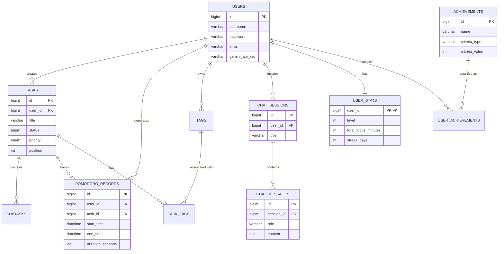
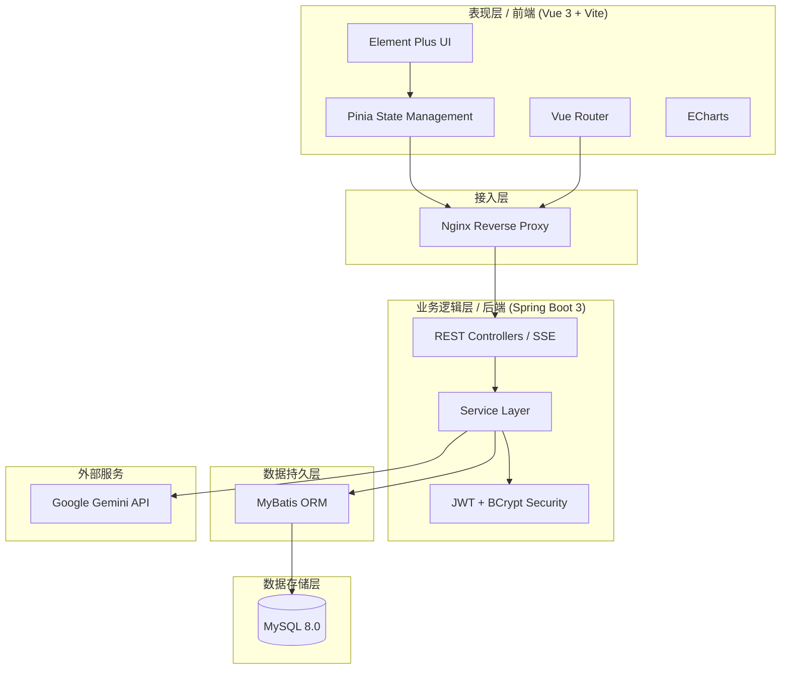
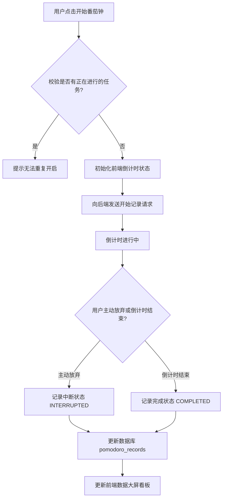
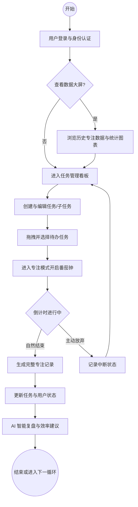

# 论文图表与数据字典生成方案（资产库）

以下内容为你提供了图表生成的直接代码和数据，你可以根据需要直接使用或修改。

## 一、 纯代码渲染图表（Mermaid 方案）
**使用方法：** 将下方的代码块复制，打开 [Mermaid Live Editor](https://mermaid.live/) 或在 Typora、Obsidian 等支持 Mermaid 的编辑器中粘贴，即可自动生成图片，右键导出 PNG 插入 Word。

### 1. 数据库 E-R 图 (实体关系图)

### 2. 核心架构图 (系统架构)

### 3. 番茄钟工作流图 (流程图)

### 4. 系统业务流程闭环图 (对应 图 3-1)

---

## 二、 数据库字段表图（Markdown 表格方案）
**使用方法：** 直接全选表格，复制并粘贴到 Microsoft Word 中，Word 会自动识别并将其转换为表格，你可以随后在 Word 中调整边框和底纹样式（建议套用学术三线表格式）。

### 1. 用户表 (users)
| 字段名 | 数据类型 | 主键/外键 | 允许为空 | 默认值 | 描述说明 |
| :--- | :--- | :--- | :--- | :--- | :--- |
| id | bigint | PK | 否 | AUTO_INCREMENT | 用户唯一标识 |
| username | varchar(50) | - | 否 | 无 | 用户登录名 |
| password | varchar(255) | - | 否 | 无 | BCrypt加密密码 |
| email | varchar(100) | - | 是 | NULL | 用户邮箱 |
| gemini_api_key | varchar(255) | - | 是 | NULL | AES加密的AI密钥 |
| created_at | timestamp | - | 是 | CURRENT_TIMESTAMP | 注册时间 |

### 2. 任务表 (tasks)
| 字段名 | 数据类型 | 主键/外键 | 允许为空 | 默认值 | 描述说明 |
| :--- | :--- | :--- | :--- | :--- | :--- |
| id | bigint | PK | 否 | AUTO_INCREMENT | 任务唯一标识 |
| user_id | bigint | FK | 否 | 无 | 关联用户ID |
| title | varchar(255) | - | 否 | 无 | 任务主标题 |
| description | text | - | 是 | NULL | 任务详细描述 |
| status | enum | - | 是 | 'TODO' | 任务状态 (TODO/IN_PROGRESS/DONE) |
| priority | enum | - | 是 | 'MEDIUM' | 优先级 (LOW/MEDIUM/HIGH) |
| position | int | - | 是 | 0 | 拖拽排序位置索引 |
| due_date | datetime | - | 是 | NULL | 截止日期 |

### 3. 番茄钟记录表 (pomodoro_records)
| 字段名 | 数据类型 | 主键/外键 | 允许为空 | 默认值 | 描述说明 |
| :--- | :--- | :--- | :--- | :--- | :--- |
| id | bigint | PK | 否 | AUTO_INCREMENT | 记录唯一标识 |
| user_id | bigint | FK | 否 | 无 | 关联用户ID |
| task_id | bigint | FK | 是 | NULL | 关联任务ID（可独立运行） |
| start_time | datetime | - | 否 | 无 | 专注开始时间 |
| end_time | datetime | - | 否 | 无 | 专注结束时间 |
| duration_seconds | int | - | 否 | 无 | 专注持续秒数 |
| status | enum | - | 是 | 'COMPLETED' | 状态(COMPLETED/INTERRUPTED) |

### 4. AI 会话消息表 (chat_messages)
| 字段名 | 数据类型 | 主键/外键 | 允许为空 | 默认值 | 描述说明 |
| :--- | :--- | :--- | :--- | :--- | :--- |
| id | bigint | PK | 否 | AUTO_INCREMENT | 消息唯一标识 |
| session_id | bigint | FK | 否 | 无 | 关联会话ID |
| role | varchar(50) | - | 否 | 无 | 角色 (user/model) |
| content | text | - | 否 | 无 | 消息与上下文内容 |
| created_at | timestamp | - | 是 | CURRENT_TIMESTAMP | 消息生成时间 |

### 5. 用户统计表 (user_stats)
| 字段名 | 数据类型 | 主键/外键 | 允许为空 | 默认值 | 描述说明 |
| :--- | :--- | :--- | :--- | :--- | :--- |
| user_id | bigint | PK, FK | 否 | 无 | 关联用户ID |
| level | int | - | 是 | 1 | 当前用户等级 |
| current_xp | int | - | 是 | 0 | 当前经验值 |
| total_focus_minutes | int | - | 是 | 0 | 累计专注总分钟数 |
| streak_days | int | - | 是 | 0 | 连续专注天数 |
| last_focus_date | date | - | 是 | NULL | 最后专注日期 |

*(提示：若需补充其余表结构，可直接基于此格式扩写。)*

---

## 三、 系统测试用例及结果表（Markdown 表格方案）
**使用方法：** 同上，直接全选表格复制并粘贴到 Word，即可自动转换为 Word 表格，随后可调整为学术三线表样式。

### 1. 交互式看板功能测试用例及结果表 (对应 表 6-1)
| 测试功能 | 测试描述 | 预期结果 | 测试结果 |
| :--- | :--- | :--- | :--- |
| 任务创建与编辑 | 1. 填写任务标题、描述等信息并提交创建。 2. 选中已有任务修改其优先级或描述。 3. 尝试以空标题创建任务校验拦截机制。 | 1. 任务创建成功并实时渲染在“待办”列中。 2. 任务信息更新成功，无数据丢失。 3. 系统拒绝保存并弹出“标题不能为空”提示。 | 通过 |
| 状态拖拽流转 | 1. 将任务卡片从“待办”列长按拖拽至“进行中”列。 2. 校验拖拽过程中的 UI 动画与占位符。 3. 拖拽完成后刷新页面，检查状态持久化。 | 1. 任务成功放置在新列，所属状态字段更新。 2. 拖拽平滑无卡顿，放下后有正确的高亮反馈。 3. 页面重载后任务依然保持在拖拽后的最新位置。 | 通过 |
| 子任务管理 | 1. 在任务详情面板中添加多个子任务。 2. 点击子任务前方的复选框切换完成状态。 3. 点击删除按钮移除特定的子任务。 | 1. 子任务成功追加并按顺序显示。 2. 子任务状态实时更新并同步计算父任务进度。 3. 子任务被成功移除且页面不再显示。 | 通过 |

### 2. 沉浸式番茄钟功能测试用例及结果表 (对应 表 6-2)
| 测试功能 | 测试描述 | 预期结果 | 测试结果 |
| :--- | :--- | :--- | :--- |
| 倒计时基础控制 | 1. 点击“开始专注”启动标准 25 分钟倒计时。 2. 观察时间每秒递减的准确性与 UI 渲染。 3. 倒计时未结束时主动点击“放弃”按钮。 | 1. 倒计时成功启动，系统进入专注模式界面。 2. 计时器匀速递减，无时间跳跃或停滞现象。 3. 倒计时终止，该次记录被标记为“中断”状态。 | 通过 |
| 异常拦截与防护 | 1. 在某任务倒计时进行中，尝试开启另一个任务的番茄钟。 2. 专注过程中刷新页面或切换至其他路由模块。 | 1. 系统拒绝开启，提示“当前已有进行中的专注任务”。 2. 依赖 Pinia 状态保持，返回或刷新后倒计时仍继续。 | 通过 |
| 数据记录持久化 | 1. 倒计时自然结束后，检查数据库中的专注记录。 2. 校验所绑定任务的总专注时长是否同步累加。 | 1. 数据库新增一条状态为“COMPLETED”的完整记录。 2. 对应任务的累计专注时间及番茄钟数量准确增加。 | 通过 |

---

## 四、 界面截图与 Python 绘图（可选方案）
1. **界面截图**：对于前端界面的展示（如暗黑模式、番茄钟倒计时界面），最真实的方案是在本地运行项目，并使用系统自带的截图工具截取高清图片。
2. **Python 数据绘图**：若你需要生成“用户活跃度热力图”等分析类插图以增加论文专业度，我可以为你编写 `matplotlib` 或 `pyecharts` 的脚本。如果你需要，请告诉我具体的图表类型。